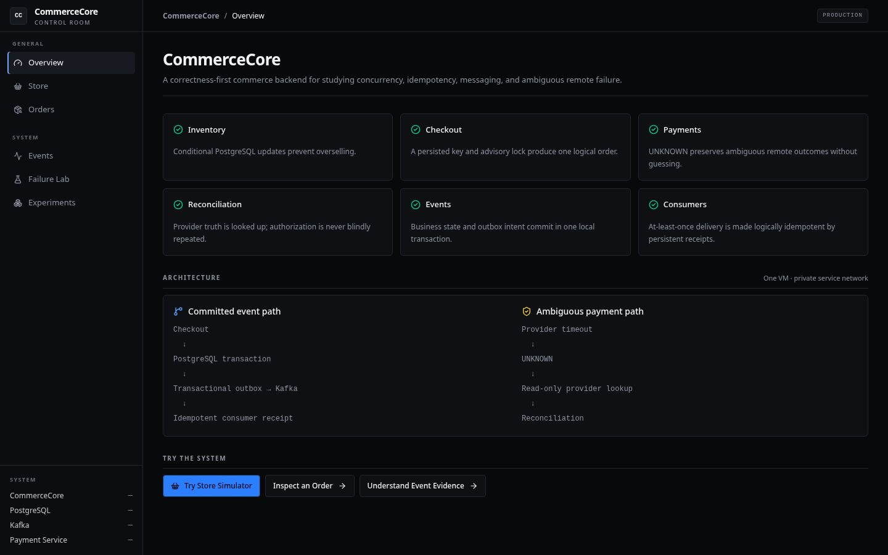

# CommerceCore

[](https://github.com/nhatminh06/commercecore/actions/workflows/ci.yml)

CommerceCore is a correctness-first e-commerce backend built to study transactional invariants,
idempotency, payment ambiguity, at-least-once messaging, reconciliation, and remote-service
failure. It is a modular Spring Boot application with one deliberately extracted gRPC Payment
Service—not a production storefront or a general microservices platform.

The project is designed around one question:

> What remains correct when requests race, processes restart, responses disappear, and messages
> are delivered more than once?

The answers are backed by real PostgreSQL, Kafka, localhost TCP gRPC, concurrent integration tests,
service restarts, failure injection, and database inspection. Start with [the guarantees](docs/guarantees.md)
and [the final failure lab](docs/failure-lab.md).

GitHub Actions validates the backend correctness suite, frontend lint/tests/production build, and
production Compose configuration.

## Run or deploy

- Local development: `docker compose up -d`, `./gradlew bootRun`, then `cd web && npm run dev`.
- Production VM: copy `.env.production.example`, provide independent strong database passwords,
  then run `docker compose --env-file .env.production -f compose.prod.yml up -d --build`.
- Full Ubuntu, firewall, Cloudflare, backup, update, and rollback instructions: [production deployment](docs/deployment.md).

The intended public hostname is `commercecore.minhpham06.com`, but this README does not advertise a
live-demo link until the HTTPS deployment has been independently verified.

## Portfolio walkthrough



1. Open **Store Simulator** and create a cart from the seeded catalog.
2. Add an item and check out with a persistent idempotency key.
3. Follow the generated order link into **Order Inspector**.
4. Review the architecture and event-evidence explanation.
5. Run Failure Lab and Concurrency Lab locally; their mutating controls are intentionally disabled
   on the public deployment.

Additional screenshots: [Store](docs/screenshots/store.png),
[Order Inspector](docs/screenshots/order-inspector.png),
[Event Explorer](docs/screenshots/event-explorer.png),
[Failure Lab](docs/screenshots/failure-lab.png), and
[Concurrency Lab](docs/screenshots/concurrency-lab.png).

## What it demonstrates

- Conditional PostgreSQL updates that prevent inventory oversell under 100-way contention.
- Reservation ownership with concurrency-safe confirm, release, and expiry transitions.
- Atomic multi-SKU checkout: reservations, order, idempotency mapping, and outbox intent commit or
  roll back together.
- Persistent checkout idempotency under sequential and 20-way concurrent retries.
- Explicit payment `PENDING`, `AUTHORIZED`, `FAILED`, and ambiguous `UNKNOWN` states.
- A real TCP gRPC provider boundary with exact minor-unit money, deadlines, durable remote
  idempotency, request conflicts, unavailability, and restart recovery.
- At-least-once webhook handling with event-level and state-level idempotency.
- A PostgreSQL transactional outbox with stable event IDs and honest accept-before-mark duplicate
  behavior.
- Real Kafka duplicate/redelivery handling using consumer-group-specific persistent receipts.
- Payment-driven order workflow: authorization confirms reservations; failure cancels and restores
  inventory once.
- Reconciliation that queries provider truth without reauthorizing and sends unsafe conflicts to
  durable `REQUIRES_REVIEW` state.

## Core invariants

```text
inventory.available_quantity >= 0

cart intent != inventory ownership
ACTIVE reservation = inventory already consumed
RELEASED/EXPIRED reservation = inventory restored once

checkout = one local transaction
same checkout key + same cart = one logical order

payment deadline/unavailability != proven decline
ambiguous authorization = UNKNOWN

providerRequestId = CommerceCore payment UUID
same provider request + same amount = same provider result
same provider request + different amount = explicit conflict

business fact + outbox intent = one local transaction
outbox/Kafka delivery = at least once
consumer business effect = idempotent through PostgreSQL receipts

reconciliation = LookupPayment, never AuthorizePayment
AUTHORIZED after reservation loss = REQUIRES_REVIEW, never automatic oversell
```

See [docs/guarantees.md](docs/guarantees.md) for each guarantee's mechanism, failure evidence, and
limitation.

## Architecture

```text
REST client
    |
    v
CommerceCore ---------------------------- gRPC ----------------> Payment Service
    |                                                               |
    v                                                               v
CommerceCore PostgreSQL                                      Provider PostgreSQL
    |
    v
outbox_events -> OutboxPublisher -> Kafka commerce.events
                                      |             |
                                      v             v
                                proof consumer   order workflow
                                      |             |
                                      v             v
                           kafka_event_receipts  order/reservation state
```

- PostgreSQL owns local atomicity, constraints, locking, and idempotency.
- gRPC provides synchronous provider commands and queries; deadline expiry is ambiguous.
- Kafka distributes facts that already committed; duplicates are expected and deduplicated by
  each consumer group independently.

CommerceCore and Payment Service own separate databases. Neither reads the other's tables, and
there is no XA or distributed transaction. See [docs/architecture.md](docs/architecture.md).

## Failure evidence

| Scenario | Observed evidence |
|---|---|
| 100 buyers race for stock 10 | 10 winners, 90 failures, stock 0 |
| Last-unit race | one winner, stock 0 |
| Concurrent double release | stock restored from 3 to 5 once |
| Multi-SKU checkout partial failure | all state and outbox intent rolled back |
| Same checkout key x20 | one order/reservation set; one stock decrement |
| Same provider request x20 | one provider row and stable reference |
| Real gRPC timeout after provider commit | provider AUTHORIZED; CommerceCore UNKNOWN |
| Payment Service unavailable | one UNKNOWN payment; order/reservation remain valid |
| Payment Service restart | same provider state/reference; one row |
| Duplicate webhook x20 | one receipt, transition, and outcome event |
| Outbox accepts then caller fails | same stable event ID delivered twice on retry |
| Duplicate Kafka records | one logical consumer receipt/effect |
| Duplicate FAILED workflow | inventory restored exactly once |
| Webhook/reconciliation race | one payment transition/outcome event |
| Authorization after expiry | payment AUTHORIZED; REQUIRES_REVIEW; no stock mutation |

The exact scenarios, commands, tests, and limitations are in
[docs/failure-lab.md](docs/failure-lab.md).

## Stack

Java 21, Spring Boot 3.3.4, Gradle 8.12, PostgreSQL 16, Flyway, Kafka 3.8.0 in KRaft mode,
Spring Kafka, Protocol Buffers, gRPC Java, JUnit 5, Testcontainers, and Docker Compose.

## Project layout

```text
src/                    CommerceCore application and tests
payment-proto/          PaymentProvider protobuf contract
payment-service/        Extracted provider process and persistent ledger
web/                    Optional engineering UI foundation for inspecting CommerceCore
scripts/failure-lab/    Focused repeatable failure suites
scripts/demo-final.sh   Real-process timeout/recovery demonstration
docs/                   Design decisions and evidence
compose.yaml            Two PostgreSQL stores, Kafka, Payment Service
```

## Build and test

Docker must be running because integration tests use Testcontainers.

```bash
./gradlew clean test
./gradlew build
```

Run focused evidence:

```bash
scripts/failure-lab/01-postgres-concurrency.sh
scripts/failure-lab/02-provider-boundary.sh
scripts/failure-lab/03-messaging-redelivery.sh
scripts/failure-lab/04-reconciliation-safety.sh
```

## Run locally

Start CommerceCore PostgreSQL, Kafka, Payment PostgreSQL, and Payment Service:

```bash
docker compose up -d
```

Start CommerceCore with its local `kafka,dev` profiles:

```bash
./gradlew bootRun
```

The optional Control Room frontend provides the engineering application shell and a Store
Simulator, a read-only Order Inspector, a development-only Event Explorer backed by persisted
outbox and consumer-receipt evidence, and a guided Failure Lab for the provider's existing one-shot
authorization outcomes. Its development-only Concurrency Lab runs bounded, backend-coordinated
correctness experiments against real state; it is not a load benchmark. Run it separately with `cd web && npm install && npm run dev`; see
[`web/README.md`](web/README.md) for configuration and scope.

Payment Service exposes gRPC on `9090`, its development control/health HTTP server on `8091`, and
its PostgreSQL on `5433`. CommerceCore uses HTTP `8080`, PostgreSQL `5432`, and Kafka `29092`.

Run the representative timeout/reconciliation/Kafka workflow:

```bash
scripts/demo-final.sh
```

Stop without deleting database volumes:

```bash
docker compose stop
```

## Main APIs

```http
POST   /api/products
GET    /api/products
GET    /api/products/{sku}
GET    /api/products/{sku}/inventory
POST   /api/products/{sku}/inventory/consume

POST   /api/carts
GET    /api/carts/{cartId}
PUT    /api/carts/{cartId}/items/{sku}
DELETE /api/carts/{cartId}/items/{sku}

POST   /api/reservations
GET    /api/reservations/{id}
POST   /api/reservations/{id}/confirm
POST   /api/reservations/{id}/release

POST   /api/carts/{cartId}/checkout
GET    /api/orders/{orderId}
GET    /api/orders/{orderId}/inspection
POST   /api/orders/{orderId}/payment
GET    /api/orders/{orderId}/payment

POST   /api/webhooks/payments
```

Checkout requires an `Idempotency-Key` header. Payment amount always comes from the persisted order,
never from a client-provided amount.

Development controls require explicit development profiles:

```http
POST localhost:8091/api/dev/provider/next-outcome
POST localhost:8080/api/dev/outbox/publish
GET  localhost:8080/api/dev/events
GET  localhost:8080/api/dev/events/{eventId}
POST localhost:8080/api/dev/payments/{paymentId}/reconcile
POST localhost:8080/api/dev/reconciliation/run?limit=25
```

These controls are verification surfaces, not authenticated production APIs.

## Documentation

- [Final guarantees](docs/guarantees.md)
- [Final failure lab](docs/failure-lab.md)
- [Architecture and ownership](docs/architecture.md)
- [Inventory](docs/inventory.md)
- [Reservations](docs/reservations.md)
- [Checkout](docs/checkout.md) and [checkout idempotency](docs/idempotency.md)
- [Payments](docs/payments.md) and [provider extraction](docs/payment-service-extraction.md)
- [Payment webhooks](docs/payment-webhooks.md)
- [Transactional outbox](docs/outbox.md)
- [Kafka delivery](docs/kafka.md)
- [Order workflow](docs/order-workflow.md)
- [Payment reconciliation](docs/reconciliation.md)
- [Redis evaluation](docs/redis-evaluation.md)

## Deliberate limitations

CommerceCore does not claim exactly-once transport, global Kafka ordering, multi-broker Kafka high
availability, multi-region durability, zero downtime, or production payment security.

The provider is simulated. Local Compose runs one Payment Service instance and one Kafka broker
with replication factor 1. gRPC is plaintext and unauthenticated with a statically configured
host/port. There is no service discovery, webhook signature verification, automatic reconciliation
or outbox scheduler, automatic refund, shipping, fulfillment, operator UI for `REQUIRES_REVIEW`,
frontend, Redis, Kubernetes, Helm, or deployment pipeline.

Those omissions are intentional: the repository demonstrates backend correctness boundaries, not
production operational completeness.
